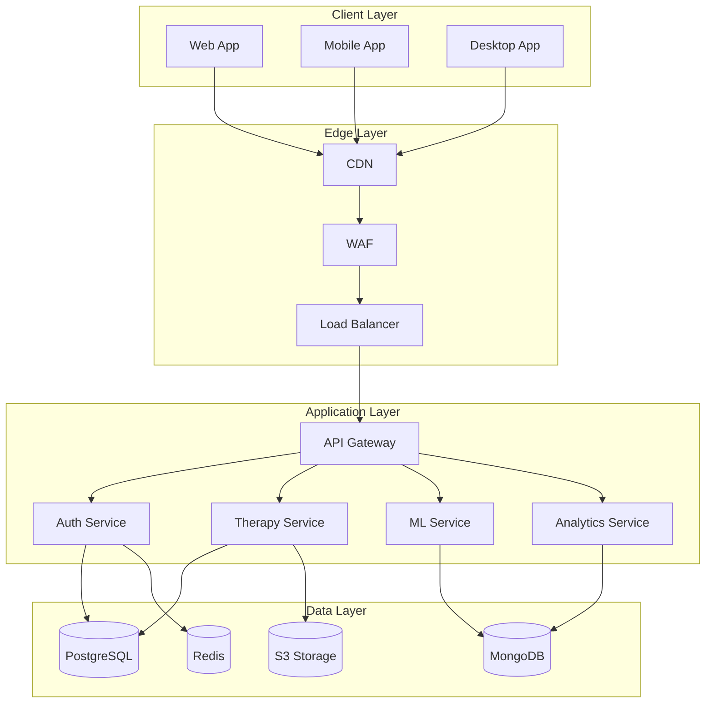
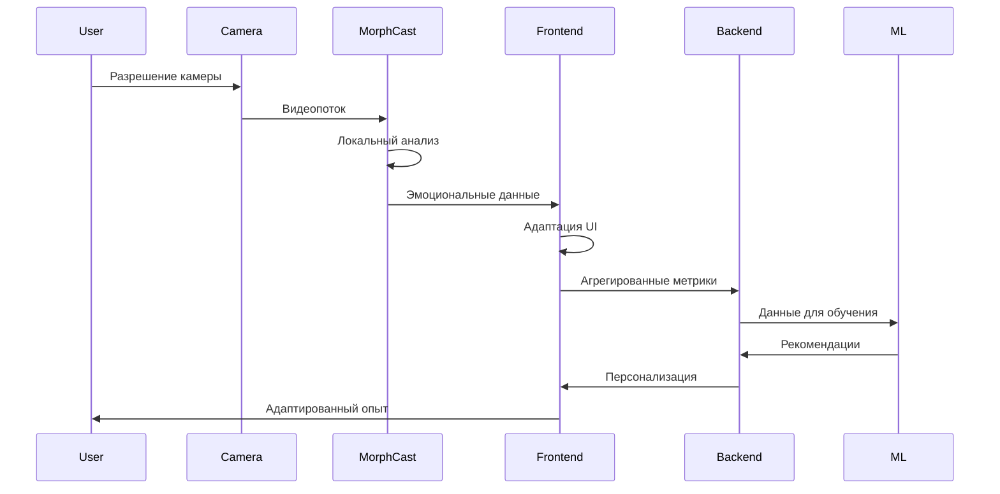
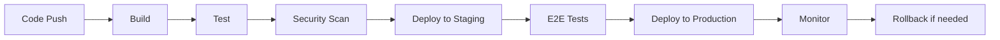

# 🏗️ Архитектура системы EMDR-AI Therapy Assistant

## 📋 Содержание

1. [Обзор системы](#обзор-системы)
2. [Архитектурные принципы](#архитектурные-принципы)
3. [Компоненты системы](#компоненты-системы)
4. [Технологический стек](#технологический-стек)
5. [Диаграммы архитектуры](#диаграммы-архитектуры)
6. [Безопасность](#безопасность)
7. [Масштабирование](#масштабирование)

## 🎯 Обзор системы

EMDR-AI Therapy Assistant построена на микросервисной архитектуре с упором на:
- **Privacy-first**: Локальная обработка чувствительных данных
- **Масштабируемость**: Горизонтальное масштабирование
- **Отказоустойчивость**: Redundancy на всех уровнях
- **Модульность**: Независимые сервисы

## 🎨 Архитектурные принципы

### 1. Privacy by Design
- Обработка эмоций на стороне клиента
- End-to-end шифрование
- Минимальный сбор данных
- GDPR/CCPA compliance

### 2. Microservices Architecture
- Независимые сервисы
- API Gateway
- Service mesh
- Event-driven communication

### 3. Cloud-Native
- Kubernetes orchestration
- Docker containers
- CI/CD pipelines
- Infrastructure as Code

### 4. Progressive Web App
- Offline-first
- Service Workers
- WebAssembly для производительности
- Responsive design

## 🔧 Компоненты системы

### Frontend Layer

```
┌─────────────────────────────────────────┐
│           Web Application               │
├─────────────────────────────────────────┤
│  React 18  │  TypeScript  │  Redux     │
│  Three.js  │  MorphCast   │  PWA       │
└─────────────────────────────────────────┘
```

#### Ключевые модули:
- **Emotion Recognition Module**: MorphCast SDK интеграция
- **EMDR Engine**: Паттерны движения и визуализация
- **Avatar System**: 3D аватары терапевтов
- **Analytics Module**: Локальная аналитика
- **Storage Module**: IndexedDB для offline

### Backend Services

```
┌──────────────┬──────────────┬──────────────┐
│   Auth       │   Therapy    │   Analytics  │
│   Service    │   Service    │   Service    │
├──────────────┼──────────────┼──────────────┤
│   User       │   Session    │   ML         │
│   Service    │   Service    │   Service    │
├──────────────┼──────────────┼──────────────┤
│   Content    │   Payment    │   Notification│
│   Service    │   Service    │   Service    │
└──────────────┴──────────────┴──────────────┘
```

#### Микросервисы:

1. **Auth Service**
   - JWT authentication
   - OAuth2 integration
   - 2FA support
   - Session management

2. **User Service**
   - Profile management
   - Preferences
   - History tracking
   - Data export

3. **Therapy Service**
   - EMDR protocols
   - Session orchestration
   - Pattern management
   - Progress tracking

4. **Session Service**
   - Real-time communication
   - WebRTC handling
   - Session recording
   - State synchronization

5. **Analytics Service**
   - Data aggregation
   - ML model serving
   - Predictive analytics
   - Reporting

6. **ML Service**
   - Model training
   - Inference API
   - Personalization
   - Anomaly detection

7. **Content Service**
   - Media storage
   - CDN integration
   - Transcoding
   - Delivery optimization

8. **Payment Service**
   - Stripe integration
   - Subscription management
   - Billing
   - Invoicing

9. **Notification Service**
   - Email (SendGrid)
   - Push notifications
   - SMS (Twilio)
   - In-app messaging

### Data Layer

```
┌──────────────┬──────────────┬──────────────┐
│  PostgreSQL  │    Redis     │   MongoDB    │
│  (Primary)   │   (Cache)    │  (Analytics) │
├──────────────┼──────────────┼──────────────┤
│     S3       │ Elasticsearch│   InfluxDB   │
│  (Storage)   │   (Search)   │  (Metrics)   │
└──────────────┴──────────────┴──────────────┘
```

### Infrastructure Layer

```
┌─────────────────────────────────────────┐
│            Kubernetes Cluster           │
├─────────────────────────────────────────┤
│   Ingress   │   Services   │   Pods    │
├─────────────────────────────────────────┤
│         Docker Containers               │
├─────────────────────────────────────────┤
│          AWS/GCP/Azure                  │
└─────────────────────────────────────────┘
```

## 💻 Технологический стек

### Frontend
- **Framework**: React 18 + TypeScript
- **State Management**: Redux Toolkit + RTK Query
- **UI Library**: Material-UI v5
- **3D Graphics**: Three.js + React Three Fiber
- **Animation**: Framer Motion + GSAP
- **Emotion Recognition**: MorphCast SDK
- **Audio**: Tone.js + Web Audio API
- **PWA**: Workbox + Service Workers
- **Testing**: Jest + React Testing Library + Cypress

### Backend
- **Runtime**: Node.js 20 LTS
- **Framework**: NestJS
- **API**: GraphQL + REST
- **Real-time**: Socket.io + WebRTC
- **Queue**: Bull + Redis
- **ORM**: Prisma
- **Validation**: Joi + class-validator
- **Testing**: Jest + Supertest

### Databases
- **Primary**: PostgreSQL 15
- **Cache**: Redis 7
- **Analytics**: MongoDB 6
- **Search**: Elasticsearch 8
- **Time-series**: InfluxDB 2
- **Object Storage**: AWS S3 / MinIO

### ML/AI
- **Framework**: TensorFlow.js + PyTorch
- **Serving**: TensorFlow Serving + TorchServe
- **MLOps**: MLflow + Kubeflow
- **NLP**: OpenAI API + Hugging Face
- **Computer Vision**: OpenCV + MediaPipe

### Infrastructure
- **Container**: Docker + Docker Compose
- **Orchestration**: Kubernetes + Helm
- **CI/CD**: GitHub Actions + ArgoCD
- **Monitoring**: Prometheus + Grafana
- **Logging**: ELK Stack
- **Tracing**: Jaeger
- **Service Mesh**: Istio
- **API Gateway**: Kong

### Security
- **WAF**: Cloudflare
- **Secrets**: HashiCorp Vault
- **Scanning**: Snyk + SonarQube
- **SIEM**: Datadog
- **Compliance**: HIPAA + GDPR tools

## 📊 Диаграммы архитектуры

### Общая архитектура



### Поток данных эмоций



## 🔒 Безопасность

### Уровни защиты

1. **Network Security**
   - TLS 1.3 everywhere
   - VPN для админ доступа
   - Network segmentation
   - DDoS protection

2. **Application Security**
   - OWASP Top 10 compliance
   - Input validation
   - SQL injection prevention
   - XSS protection
   - CSRF tokens

3. **Data Security**
   - Encryption at rest (AES-256)
   - Encryption in transit (TLS)
   - Key rotation
   - Data anonymization
   - PII tokenization

4. **Access Control**
   - RBAC (Role-Based Access Control)
   - MFA (Multi-Factor Authentication)
   - API rate limiting
   - Session management
   - Audit logging

5. **Compliance**
   - GDPR compliance
   - CCPA compliance
   - HIPAA ready
   - SOC 2 Type II
   - ISO 27001

### Privacy Architecture

```
┌─────────────────────────────────────────┐
│         User Device (Browser)           │
│  ┌───────────────────────────────────┐  │
│  │   MorphCast SDK (Local Only)      │  │
│  │   - Face Detection                │  │
│  │   - Emotion Analysis              │  │
│  │   - No Server Upload              │  │
│  └───────────────────────────────────┘  │
│  ┌───────────────────────────────────┐  │
│  │   Local Storage (Encrypted)       │  │
│  │   - Session Data                  │  │
│  │   - User Preferences              │  │
│  │   - Offline Cache                 │  │
│  └───────────────────────────────────┘  │
└─────────────────────────────────────────┘
         │
         │ Only Aggregated Metrics
         ▼
┌─────────────────────────────────────────┐
│            Backend Services             │
│   - No Raw Video/Images                 │
│   - No Identifiable Data                │
│   - Only Statistical Information        │
└─────────────────────────────────────────┘
```

## 📈 Масштабирование

### Горизонтальное масштабирование

```yaml
apiVersion: autoscaling/v2
kind: HorizontalPodAutoscaler
metadata:
  name: therapy-service-hpa
spec:
  scaleTargetRef:
    apiVersion: apps/v1
    kind: Deployment
    name: therapy-service
  minReplicas: 3
  maxReplicas: 100
  metrics:
  - type: Resource
    resource:
      name: cpu
      target:
        type: Utilization
        averageUtilization: 70
  - type: Resource
    resource:
      name: memory
      target:
        type: Utilization
        averageUtilization: 80
```

### Стратегии кэширования

1. **CDN Level**
   - Static assets
   - API responses (где применимо)
   - Geo-distributed

2. **Application Level**
   - Redis для сессий
   - In-memory caching
   - Query result caching

3. **Database Level**
   - Connection pooling
   - Query optimization
   - Read replicas
   - Sharding

### Performance Targets

- **Latency**: < 100ms (p99)
- **Throughput**: 10,000 RPS
- **Availability**: 99.99%
- **Error Rate**: < 0.01%
- **Time to First Byte**: < 200ms

## 🔄 Deployment Pipeline



## 📱 Mobile Architecture

### React Native Architecture

```
┌─────────────────────────────────────────┐
│          React Native App               │
├─────────────────────────────────────────┤
│   JavaScript Thread  │  Native Modules  │
├─────────────────────────────────────────┤
│      Bridge Layer                       │
├─────────────────────────────────────────┤
│   iOS Native        │  Android Native   │
└─────────────────────────────────────────┘
```

### Offline Capabilities

- **SQLite**: Local database
- **AsyncStorage**: Key-value storage
- **Background Sync**: When online
- **Push Notifications**: FCM/APNS

## 🌐 Multi-Region Architecture

```
┌─────────────────────────────────────────┐
│           Global Load Balancer          │
└─────────────────────────────────────────┘
                    │
    ┌───────────────┼───────────────┐
    ▼               ▼               ▼
┌─────────┐   ┌─────────┐   ┌─────────┐
│   US    │   │   EU    │   │  APAC   │
│ Region  │   │ Region  │   │ Region  │
└─────────┘   └─────────┘   └─────────┘
    │               │               │
    ▼               ▼               ▼
┌─────────┐   ┌─────────┐   ┌─────────┐
│   DB    │◄──│   DB    │◄──│   DB    │
│ Primary │   │ Replica │   │ Replica │
└─────────┘   └─────────┘   └─────────┘
```

## 🚀 Future Considerations

### Blockchain Integration
- Децентрализованная идентификация
- Смарт-контракты для страхования
- Токенизация прогресса

### Edge Computing
- WebAssembly для ML моделей
- Local-first architecture
- P2P синхронизация

### Quantum-Ready
- Post-quantum криптография
- Quantum-resistant алгоритмы
- Готовность к миграции

---

**Документ обновлен:** 06.09.2025
**Версия:** 1.0.0
**Автор:** EMDR-AI Architecture Team